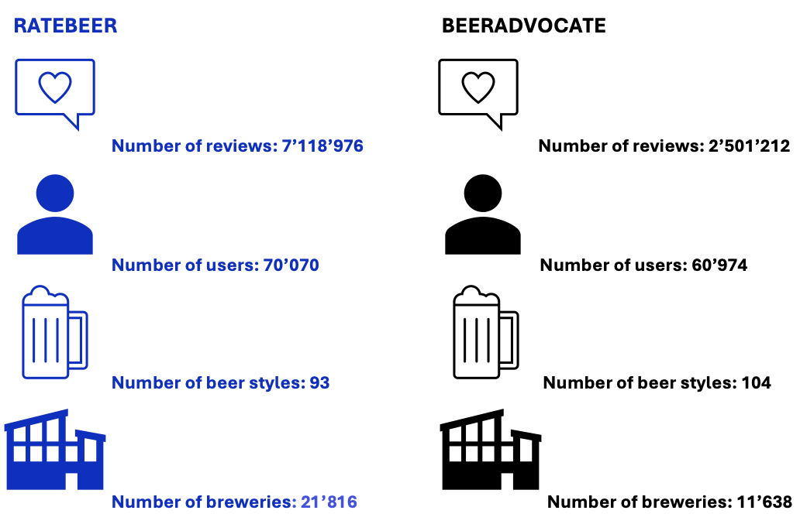
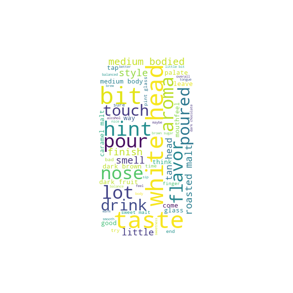
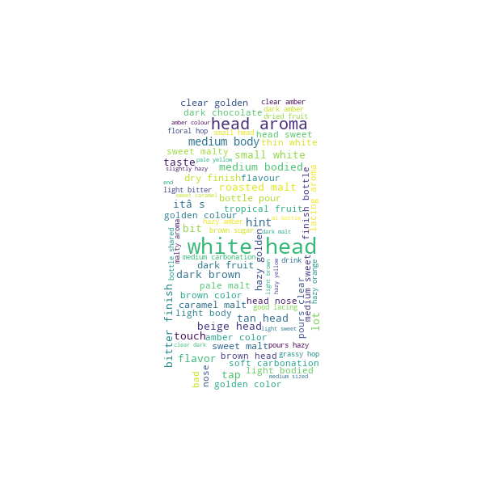

# Introduction
It's not uncommon to have to choose between two similar items, whether it's between two books in a bookshop, two different telephones or even between two restaurants on Google. In these situations, we're very happy to find in-store advisers or online reviews (maybe both for the more methodical) to help us make the final choice. But it's much less common to seek advice on choosing between two rating platforms or application on the internet. Perhaps you could ask friends who use them, but if you're not so lucky or if you just want to check what they say, we're offering to be that friend today! 

Our aim is to help you decide between the two rating platforms: **BeerAdvocate** and **RateBeer**, so you can decide which one suits you best. To do this, we're going to present several interesting aspects of each of the two platforms, so that you can compare them and get a better idea of how they work, their respective communities and the type of reviews you might find.

# Plateforms description

Today's dilemma is between RateBeer and BeerAdvocate, two competing platforms, and you're here to make a choice. To give you an initial idea, here are some overall numbers on these two rivals (obtained from data collected up to July 2017).

Here’s already something interesting: while the number of users on RateBeer and BeerAdvocate is pretty close, the difference in activity is massive. Users on RateBeer are like turbo-charged reviewers, contributing three times more reviews than those on BeerAdvocate. It seems RateBeer users just can’t stop sharing their thoughts on every sip, while BeerAdvocate users might be taking their time, savoring the moment before hitting “post.” But before looking at this reviewers, let's first have a look at the rating system.

# How ratings works ?

The rating system is essential for understanding the scores given to a beer. Notably, the same overall rating on BeerAdvocate and RateBeer does not reflect identical scores across different topics. In theory, if a user provides the same scores and descriptions for a beer on both platforms, the final rating would still differ between the two sites.

The topics considered in these ratings are as follows: **"appearance," "aroma," "palate," "taste," and "overall."** Concretely, the final rating is a weighted average of these topics' ratings. Our objective is to determine these weights.
We find the following weight for the topics:



### Analysis of BeerAdvocate and RateBeer Notation System

BeerAdvocate and RateBeer assign similar weights to **appearance**, **aroma**, and **palate** (approximately 6%-9%, 20%-24%, and 10%, respectively). These criteria contribute comparably to the overall rating on both platforms.

However, significant differences emerge for **taste** and **overall**:  
- BeerAdvocate gives much greater weight to **taste** (40%) compared to RateBeer (20%), indicating that the perception of taste is crucial for high ratings on BeerAdvocate.  
- Conversely, RateBeer assigns double the weight to **overall** (42%) than BeerAdvocate (20%), emphasizing a more general, holistic evaluation.

### Implications:  
- **BeerAdvocate** prioritizes sensory aspects like **taste**, making it key for achieving high ratings.  
- **RateBeer** takes a broader approach, with the **overall** impression being the most critical factor.

This distinction helps explain why the same beer may receive different scores across the two platforms, even with similar topic-level ratings.

# Who are the interesting users ?

At the heart of every review platform lies its users. Some casually share their thoughts from time to time, while others stand out as experienced reviewers—those who provide detailed, consistent, and insightful contributions. Not all reviews are created equal. The true gems come from the seasoned pros—those who know their hops from their malts and can turn a sip into a story. These expert reviewers don’t just share opinions; they provide reliable, detailed, and insightful takes that cut through the noise.

By shining a spotlight on these top contributors, we’re laying the groundwork for a deeper dive later on, where we’ll analyze their reviews in detail. Understanding who these experts are is key to unlocking the true strengths of BeerAdvocate and RateBeer, giving us a richer, clearer picture of each platform’s review quality and the community behind the ratings

But what exactly makes a reviewer an expert? Is it their consistency, their diversity of tastes, or the sheer volume of reviews they write?

To address this, we analyzed user behavior to identify patterns that distinguish the most valuable contributors.

**Defining "Experience"**
"Experience" is not a single metric; it’s a combination of multiple factors that reflect a user’s activity and engagement on the platform. For this analysis, we focused on three key indicators:

- Total Reviews:
The total number of reviews written by a user—measuring their overall contribution to the platform.

- Consistency Over Time:
Using the mean and standard deviation of time intervals between reviews, we capture both regularity and variability:
A low standard deviation indicates steady, consistent reviewing behavior.
A higher mean or large gaps between reviews suggests more sporadic contributions.

- Style Diversity:
The number of beer styles a user has reviewed, reflecting their willingness to explore different types of beers. Greater diversity often correlates with broader knowledge and a more experienced palate.

By combining these three features, we constructed a robust definition of "experience" that moves beyond simple review counts to capture a more nuanced picture of user behavior.

### Clustering (KMeans)

Finding the Clusters: Where Do the Experts Hide?
To group users into meaningful categories, we turned to K-Means Clustering, a method that allows us to organize users based on their review habits. Think of it like sorting beer drinkers into categories:

- The curious explorers who try a bit of everything, but don't post very often
- The steady contributors who are reliable and consistent, and
- The hardcore enthusiasts who live and breathe beer reviews.

To figure out how many groups made the most sense, we used the elbow method, a technique that helps pinpoint the “sweet spot” for clustering. For both BeerAdvocate and RateBeer, the magic number turned out to be 3 clusters.




A deeper look at the features shows that the 3 experience levels are separated in a simple way, which makes us question the choice of clustering instead of using thresholds. 

### Thresholds VS Clusters
An other way to find groups of people based on experience, is as following. Users were categorized into four groups based on their review activity: **Experts**, **Intermediate**, **Novices**, and **Debutants**.  

- **Experts** were identified as the smallest group of users responsible for at least **50%** of the total reviews. This was done by sorting users by their review counts and iteratively summing their contributions until the threshold was met.  
- The remaining users were divided into **Intermediate** (top 10%), **Novices** (next 40%), and **Debutants** (bottom 50%) based on their proportion of total reviews and user counts.  

This classification highlights the disparity in review contributions across different user groups.




#### BeerAdvocate
- **Experts**: 1.48% of users, 50.00% of reviews  
- **Intermediate**: 8.52% of users, 37.15% of reviews  
- **Novices**: 40.00% of users, 11.32% of reviews  
- **Debutants**: 50.00% of users, 1.53% of reviews  

#### RateBeer
- **Experts**: 0.87% of users, 50.00% of reviews  
- **Intermediate**: 9.13% of users, 44.53% of reviews  
- **Novices**: 40.00% of users, 4.87% of reviews  
- **Debutants**: 50.00% of users, 0.59% of reviews  

#### Conclusion
1. A small fraction of users (**Experts**) contribute around **50%** of reviews.  
2. The majority of users (**Novices** and **Debutants**) contribute minimally despite representing over **90%** of the user base.  

#### Next Steps
Given the significant influence of **Experts** on the review landscape, we will now focus our analysis on their reviews to better understand their impact on the platforms and their content quality. And as expected, the main criteria to define experience of a user is its number of reviews. Thus, this is the feature that will be used for the next part.

# What language do they speak ?

Now that we've established who these famous experts are, we're going to try and understand which languages they use in their reviews. Maybe we could differentiate our two platforms using this criterion ?

We utilized the powerful fasttext library [ref] to analyse the language of our experts' reviews, and unfortunately we got the following results:

No such luck... We won't be able to separate our two rivals like that. The vast majority of experts comment in English. On RateBeer, there is a slightly greater diversity of languages, with almost 150'000 non-English reviews (just under 5% of the total number of reviews). On the second place we find german, then french and norvegian. On BeerAdvocate, on the other hand, there is no doubt that the experts speak English, with a few exceptions (we can't even see it on the graph). 

In any case, what's certain is that we're going to keep the English-speaking experts for the rest of our research. In any case, these days, English is increasingly spoken and understood. If you're reading this article, I'm sure you'll at least agree with this decision.

# Which sentiment do they express the most?

Let’s be honest, when you’re choosing a platform, it’s not just about the features or how many users it has. It’s also about the vibe. Are the reviews upbeat and encouraging? Or are they super critical and serious? The tone of a platform’s reviews can say a lot about its community and what kind of experience you’ll have there.

To get a feel for the mood on BeerAdvocate and RateBeer, we decided to dive into the reviews of the experts and do a little detective work. Using something called sentiment analysis (basically, a fancy way of figuring out if people are being positive, negative, or neutral), we analyzed the expert's reviews to uncover the overall tone.

This way, we’re not just guessing—we’ve got data to back it up! Is BeerAdvocate full of passionate beer lovers who rave about every sip? Are RateBeer users more critical and straight to the point? Or is it a mix of everything?

Whether you’re looking for a platform with happy vibes or a community that isn’t afraid to tell it like it is, this analysis might help you decide where you’ll feel most at home. Let’s see the way the experts express their taste for a beer !

First, let's look at what proportion of each reviews is considered as negative, positive or neutral :



It seems that both platforms have a similar mix of positive, negative, and neutral tones...The majority of reviews have a low proportion of negative words. The positive scores tend to be spread out, but again remainin quite low, showing that many reviews lean toward being mildly to moderately positive. Neutral scores stands out, highlighting a group of reviewers who provide balanced, descriptive feedback without leaning strongly positive or negative.

For example, a review like “The beer has a smooth texture and a pleasant taste” might score high on neutrality due to its descriptive language but still reflect positivity because of words like “smooth” and “pleasant”. On the flip side, a review such as “The beer lacks flavor and is quite bland” could also show neutrality in tone but carry a negative sentiment because of words like “lacks” and “bland”.

This nuanced balance of sentiment shows that reviewers on both platforms aren’t just cheerleaders or critics—they’re detailed and expressive, capturing the good, the bad, and everything in between. But now, let's have a look at the overall sentiment of experts reviews.



If you’re looking for a place full of positive energy and excitement, BeerAdvocate might just be your new home. A massive 91% of expert reviews on BeerAdvocate are positive. These reviewers are passionate about their beers and don’t hold back when it comes to sharing the love.

Negative reviews? They’re rare here—only 7.54% of reviews express dissatisfaction. And as for neutrality? Forget it. Just 1.43% of reviews sit on the fence. The BeerAdvocate community loves to share their opinions, and those opinions are overwhelmingly upbeat. So, if you’re the kind of person who enjoys reading reviews that make you excited to grab your next pint, BeerAdvocate is where the vibe is all about celebrating great beer.

On the other hand, if you prefer reviews that are more critical, balanced, and to the point, RateBeer might feel like a better fit. Here, 75.3% of reviews are positive—still a majority, but far less than BeerAdvocate. That means RateBeer experts aren’t afraid to share what didn’t impress them. In fact, 15.5% of reviews are negative, making this platform twice as likely to feature critical feedback. And for those who value objectivity, 9.15% of reviews are neutral—far more than you’ll find on BeerAdvocate. RateBeer has a vibe that’s more serious and straightforward. It’s a space for beer lovers who appreciate a more discerning perspective. If you’re looking for honesty and detail, even when it’s not all glowing praise, you’ll likely feel right at home here.

While there are differences in tone, one thing is clear: both BeerAdvocate and RateBeer tend to lean positive overall. Even on RateBeer, where reviews are a bit more critical, the majority—over 75%—of expert reviews still celebrate the beers they’re reviewing. So, while the vibe might feel different, there’s no shortage of appreciation for great beer on either platform.

# What kind of words do they use?

When you dive into expert reviews, you’ll quickly notice that words paint a picture. Whether it’s describing the aroma, the taste, or the visual appeal, reviewers use a rich vocabulary to capture their experience. But how can we identify the dominant themes in thousands of reviews without drowning in the details?

To begin, we’ve chosen a simple yet effective method: WordClouds. These clouds offer a quick and intuitive glimpse into the topics that matter most to BeerAdvocate and RateBeer communities. While it’s not as advanced as machine learning techniques (like Topic Modeling), it’s a perfect first step for spotting trends, patterns, and standout words.

    

        
    

    

        
    

BeerAdvocate reviewers are all about the taste and flavor—the heart and soul of any great beer experience. Words like "taste", "aroma", and "flavor" dominate, showing a clear focus on the sensory elements. But they don’t stop there—presentation also gets its fair share of attention, with frequent mentions of foam, color, and clarity. After all, a beer has to look as good as it tastes, right?
On the other hand, RateBeer experts serve up a similarly detailed analysis of flavor and aroma, but with a broader palette of terms. You’ll find mentions of "bitter", "sweet malt", and even "tropical fruit", offering both general impressions and specific tasting notes. They’re equally observant about appearance and mouthfeel, commenting on foam color, carbonation, and the beer’s body with precision.

Of course, WordClouds are a bit like skimming the headlines—they show us which words pop up most often, but they don’t capture the context or the deeper connections between words. So while this quick visual dive gives us a snapshot of each platform’s style, there’s more to uncover beneath the surface. Stay tuned, because we’re taking this analysis up a notch with more sophisticated techniques that dig into the true themes of these reviews!

## **What Are the Experts Really Talking About?**

We’ve already taken a **quick peek** at the words BeerAdvocate and RateBeer experts use with our **WordClouds**. That simple and intuitive approach gave us an overview of the vocabulary that stands out on both platforms—words like **“aroma”**, **“taste”**, and **“foam”** on BeerAdvocate, and mentions of **“citrus”**, **“hoppy”**, and **“tropical fruit”** on RateBeer.

But WordClouds, as fun as they are, are just scratching the surface. They show us which words appear most frequently, but not **how these words connect** to each other or what **bigger themes** are hiding in the reviews.

Now, let’s take this analysis **to the next level**.

---

### **Why Conduct Topic Modeling?**

Choosing the right platform isn’t just about **vocabulary** or even **sentiment**—it’s about understanding the **themes** that dominate the reviews. What do BeerAdvocate and RateBeer communities **really care about**?  

Are the experts more focused on:
- The **sensory experience** of a beer—like its aroma, foam, or texture?  
- **Modern craft trends**—like hazy IPAs, tropical flavors, or roasted stouts?  
- Or do they explore the broader **drinking environment**, mentioning brewpubs, taps, and community experiences?  

By conducting **Topic Modeling** with Latent Dirichlet Allocation (LDA), we can uncover these themes and pinpoint the **focus areas** of each platform. This deeper dive will give you the insights to decide which community aligns best with your **tastes and interests**.

---

### **What We Did**

1. **Document Segmentation**:  
   To make the analysis manageable, we split the reviews into **chunks** of about **50 sentences each**, treating them as smaller "documents."

2. **Topic Detection with LDA**:  
   We used **LDA Topic Modeling**, a machine learning technique that identifies clusters of words frequently used together. Each cluster (or **topic**) represents a **theme** found in the reviews.

3. **Visualizing the Results**:  
   - A **heatmap** shows the distribution of detected topics across BeerAdvocate and RateBeer.
   - An interactive **PyLDAvis** plot allows us to explore the topics in greater detail and understand how they relate to each other.

---

### **Topic Distribution: BeerAdvocate vs RateBeer**

The **heatmap** below reveals how the detected topics are distributed across the two platforms:  



#### **What Does the Heatmap Reflect?**
- **BeerAdvocate**:
   - Topics **0**, **5**, and **6** dominate, showing a strong focus on **sensory details** like aroma, mouthfeel, and beer appearance.
   - This suggests a **classic review style** where reviewers highlight the finer sensory characteristics of beer.

- **RateBeer**:
   - Topics are distributed more **evenly** across multiple themes, with significant presence in **Topics 1, 3, 4, 7, 8, and 9**.
   - This diversity reflects a broader focus on **beer styles**, tasting notes, and even the drinking environment (e.g., brewpubs, taps).

In essence, BeerAdvocate reviews are **more focused** and sensory-driven, while RateBeer reviews cover a **wider range** of beer-related experiences.

---

### **Interactive Exploration with PyLDAvis**

Beyond the heatmap, the **PyLDAvis visualization** allows us to interactively explore the detected topics.  



#### **What PyLDAvis Tells Us:**
1. **Intertopic Distance Map**:
   - Each **circle** represents a topic, and the size of the circle indicates its **prevalence**.
   - Topics that are **closer together** share similar words and themes. For example, Topics **1, 2, and 7** cluster together, suggesting a shared focus on sensory descriptions and tasting notes.
   - Distinct topics (like **Topic 4**) are farther apart, reflecting unique and specialized themes.

2. **Top-30 Most Salient Words**:
   - On the right-hand side, you can see the **most important words** for each topic.
   - For example, words like **“aroma”**, **“appearance”**, and **“glass”** dominate BeerAdvocate-heavy topics, while RateBeer topics feature words like **“citrus”**, **“hazy”**, and **“roasted”**, showcasing craft beer trends and variety.

3. **Interactivity**:
   - You can select a topic and explore its key terms to gain a deeper understanding of what the community focuses on.
   - Adjust the **relevance slider** to fine-tune the importance of frequent vs. unique words.

---

### **Key Insights for New Users**

The combination of the **heatmap** and **PyLDAvis** reveals clear differences between BeerAdvocate and RateBeer:

| **Platform**       | **Key Themes**                                                                 |
|---------------------|------------------------------------------------------------------------------|
| **BeerAdvocate**    | Sensory details like aroma, appearance, and mouthfeel dominate.               |
| **RateBeer**        | Diverse beer styles, modern trends (hazy, roasted), and drinking environments. |

#### **Who Should Use BeerAdvocate?**
- If you love **structured reviews** that celebrate sensory details—like aroma, foam, and taste—BeerAdvocate is your best fit.  
- This platform is perfect for those who appreciate **traditional beer reviews** with detailed, aesthetic evaluations.

#### **Who Should Use RateBeer?**
- If you want to explore a **broader range of beer experiences**—including modern craft beer trends, niche styles, and discussions about drinking environments—RateBeer is the platform for you.  
- It’s ideal for beer adventurers who enjoy diverse, critical, and trend-focused reviews.

---

### **Conclusion**

Through **Topic Modeling**, we’ve uncovered the unique focus areas of BeerAdvocate and RateBeer:
- **BeerAdvocate**: A platform for detailed, sensory-driven reviews.  
- **RateBeer**: A hub for diversity, modern craft trends, and global beer experiences.

So, which community matches your style? Whether you prefer the classic depth of BeerAdvocate or the exploratory spirit of RateBeer, the choice is yours. Cheers to discovering your next favorite platform! 🍻

# The final choice

Together, these analyses form a comprehensive picture of what each platform offers, allowing beer enthusiasts to make informed decisions about which platform best suits their needs. Whether you value detailed evaluations, insightful reviewers, or a vibrant and diverse community, this project aims to guide you to the right choice.

# References

To complete this project, we have used various resources, which are listed here.

- [[paper][A]] Julian McAuley, Jure Leskovec, Dan Jurafsky, **Learning Attitudes and Attributes from Multi-Aspect Reviews**, Stanford.

- [[paper][B]] Gael Lederrey, Robert West, **When Sheep Shop: Measuring Herding Effects in Product Ratings with Natural Experiments**, EPFL.

- [[website][14]] Wikipedia **Timeline of Computer Animation**

- [[image][G]] By Athanasius Kircher, Public Domain

[A]: http://i.stanford.edu/~julian/pdfs/icdm2012.pdf
[B]: https://dlab.epfl.ch/people/west/pub/Lederrey-West_WWW-18.pdf

[14]: https://en.wikipedia.org/wiki/Timeline_of_computer_animation_in_film_and_television
[G]: https://commons.wikimedia.org/w/index.php?curid=52666213
