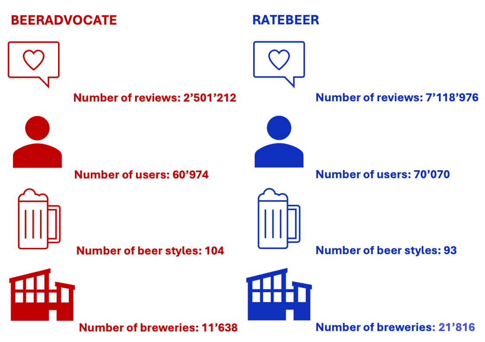

# Introduction
It's not uncommon to have to choose between two similar items, whether it's between two books in a bookshop, two different telephones or even between two restaurants on Google. In these situations, we're very happy to find in-store advisers or online reviews (maybe both for the more methodical) to help us make the final choice. But it's much less common to seek advice on choosing between two rating platforms or application on the internet. Perhaps you could ask friends who use them, but if you're not so lucky or if you just want to check what they say, we're offering to be that friend today! 

Our aim is to help you decide between the two rating platforms: **BeerAdvocate** and **RateBeer**, so you can decide which one suits you best. To do this, we're going to present several interesting aspects of each of the two platforms, so that you can compare them and get a better idea of how they work, their respective communities and the type of reviews you might find.

# Plateforms description

Today's dilemma is between BeerAdvocate and RateBeer, two competing platforms, and you're here to make a choice. To give you an initial idea, here are some overall numbers on these two rivals (obtained from data collected up to July 2017).

Here’s already something interesting: while the number of users on BeerAdvocate and RateBeer is pretty close, the difference in activity is massive. Users on RateBeer are like turbo-charged reviewers, contributing three times more reviews than those on BeerAdvocate. It seems RateBeer users just can’t stop sharing their thoughts on every sip, while BeerAdvocate users might be taking their time, savoring the moment before hitting “post.” But before looking at this reviewers, let's first have a look at the rating system.

# How ratings works ?

The rating system is essential for understanding the scores given to a beer. Notably, the same overall rating on BeerAdvocate and RateBeer does not reflect identical scores across different topics. In theory, if a user provides the same scores and descriptions for a beer on both platforms, the final rating would still differ between the two sites. Our aim is therefore to understand what lies behind these two rating systems in order to understand which parameters are valued by each of the two platforms.

The topics considered in these ratings are as follows: **"appearance," "aroma," "palate," "taste," and "overall."** Concretely, the final rating is a weighted average of these topics' ratings. Our objective is to determine these weights.
We find the following weight for the topics:



### Analysis of BeerAdvocate and RateBeer Notation System

BeerAdvocate and RateBeer assign similar weights to **appearance**, **aroma**, and **palate** (approximately 6%-9%, 20%-24%, and 10%, respectively). These criteria contribute comparably to the overall rating on both platforms.

However, significant differences emerge for **taste** and **overall**:  
- BeerAdvocate gives much greater weight to **taste** (40%) compared to RateBeer (20%), indicating that the perception of taste is crucial for high ratings on BeerAdvocate.  
- Conversely, RateBeer assigns double the weight to **overall** (42%) than BeerAdvocate (20%), emphasizing a more general, holistic evaluation.

If you’re all about the sensory details—flavor, the nuances of taste—this, BeerAdvocate is the platform for you. Reviewers here focus on the experience of the sip, making it a great choice if you want to explore beers from a flavor-first perspective.
If you’re looking for a more well-rounded view, where the overall impression of a beer takes priority, RateBeer might be your go-to.

Surely this distinction isn't enough for you to make up your mind yet, but if you're a professional dabbler I suspect it will have swayed you one way rather than the other. That's why we're going to try and differentiate the two platforms a little more by focusing on a very specific group of users: the experts! You are now wondering, what do we mean by **experts**, let's start from the beginning...

# Who are the interesting users ?

At the heart of every review platform lies its users. Some casually share their thoughts from time to time, while others stand out as experienced reviewers—those who provide detailed, consistent, and insightful contributions. Not all reviews are created equal. The true gems come from the seasoned pros—those who know their hops from their malts and can turn a sip into a story. These **expert** reviewers don’t just share opinions; they provide reliable, detailed, and insightful takes that cut through the noise.

By shining a spotlight on these top contributors, we’re laying the groundwork for a deeper dive later on, where we’ll analyze their reviews in detail. Understanding who these experts are is key to unlocking the true strengths of BeerAdvocate and RateBeer, giving us a richer, clearer picture of each platform’s review quality and the community behind the ratings. But what exactly makes a reviewer an expert? Is it their consistency, their diversity of tastes, or the sheer volume of reviews they write?

A first simple way to better understand the community is by categorizing users based on their review activity. Here’s how we divided them:

**Experts:**
The smallest but most influential group, these users are responsible for 50% of all reviews.
We identified them by ranking users based on their review counts and summing their contributions until this threshold was reached.

And the remaining user were divided into :

**Intermediates:**
The top 10% of remaining users, contributing significantly but not at the same scale as the Experts.

**Novices:**
Representing the next 40%, these users are occasional contributors.

**Debutants:**
The bottom 50% of users, who are just starting out or have written very few reviews.

Let's exactly see the proportion they all represent in terms of total users and total reviews : 



**The Power of Experts**:  

On both platforms, the smallest group of users, less than 2% of the community, stands out as the driving force, contributing an impressive 50% of all reviews. These are the dedicated reviewers, the ones who consistently share their insights and shape the platforms' content.

On the other hand, 50% of users, classified as Debutants, are more reserved in their contributions, accounting for just 1.53% of reviews on BeerAdvocate and 0.59% on RateBeer.
   
Even if everyone plays a role, this underscores just how crucial Experts are to the lifeblood of these platforms. These power users don’t just contribute—they define the very essence of the community. Without their dedication and relentless passion, the rich tapestry of reviews and insights would be a shadow of what it is today. 

While this threshold-based grouping provides a straightforward categorization, it doesn’t capture the behavioral nuances of reviewers. To refine our analysis, and group users into meaningful categories, we turned to another method, called K-Means Clustering, that allows us to organize users based on three key dimensions of “experience”.

**Experience** is not a single metric; it’s a combination of multiple factors that reflect a user’s activity and engagement on the platform. For this analysis, we focused on three key indicators:

- Total Reviews:
The total number of reviews written by a user—measuring their overall contribution to the platform.

- Consistency Over Time:
Using the mean and standard deviation of time intervals between reviews, we capture both regularity and variability:
A low standard deviation indicates steady, consistent reviewing behavior.
A higher mean or large gaps between reviews suggests more sporadic contributions.

- Style Diversity:
The number of beer styles a user has reviewed, reflecting their willingness to explore different types of beers. Greater diversity often correlates with broader knowledge and a more experienced palate.

By combining these features, we constructed a robust definition of "experience" that moves beyond simple review counts to capture a more nuanced picture of user behavior.

### Clustering (KMeans)

Where do experts hide ? Let's find the clusters.
The method that allows us to organize users based on their review habits. Think of it like sorting beer drinkers into categories:

- The curious explorers who try a bit of everything, but don't post very often
- The steady contributors who are reliable and consistent, and
- The hardcore enthusiasts who live and breathe beer reviews.

To figure out how many groups made the most sense, we used the elbow and silhouette method, a technique that helps pinpoint the “sweet spot” for clustering. For both BeerAdvocate and RateBeer, the magic number turned out to be 3 clusters.

But how do you see these clusters? That’s where we added an extra step: we used a technique called Principal Component Analysis (PCA). Think of PCA as a way to create a “map” of the clusters by simplifying the data, making the differences between groups easier to visualize. This allowed us to clearly see how our three clusters stood apart—bringing the hidden patterns of beer expertise to light!



Through clustering, distinct groups of users began to emerge, each with its own unique personality. This approach let us zero in on the true experts, uncovering their habits, consistency, and passion for beer reviews.

But we’re not stopping there. To keep things interesting, we’re pitting this method against the simpler, threshold-based approach. The goal? To see if the experts we found with the threshold method are also pointed out by the clusering method.

|                                | BeerAdvocate | RateBeer  |
|--------------------------------|--------------|-----------|
| **Number of experienced users with Clustering method** | 8396         | 8652      |
| **Number of experienced users with Threshold method**  | 902          | 611       |
| **Percentage of experienced users from Threshold in group from Clustering** | 100.00%      | 100.00%   |

Good news, the experts highlighted by the first (threshold) method are also found by the clustering method. Actually, this is not so surprising... The threshold method focuses on identifying users with a high number of reviews, highlighting those who have consistently engaged with the platform over time, while clustering groups users based on other behavioral patterns, the number of reviews also being included in the features. 

By taking the experts identified through the threshold method, we prioritize users whose contributions are quantifiable and whose knowledge is backed by substantial activity. Since they represent already 50% of the reviews, this refined subset serves as a sufficient and solid foundation and offers a focused lens for deeper analysis.

#### Next Steps
Given the significant influence of **Experts** on the review landscape, we will now focus our analysis on their reviews to better understand their impact on the platforms and their content quality.

# What language do they speak ?

First we're going to analyze which languages these famous experts use in their reviews. Maybe we could differentiate our two platforms using this criterion ?

We utilized the powerful fastText library to analyze the language of our experts' reviews. We referred to this [comparison of language detection models](https://modelpredict.com/language-identification-survey) to evaluate various options. fastText stood out for its robust performance, ease of use, and the ability to handle large-scale data efficiently, making it an excellent choice for our analysis. Let's see the language of the experts reviews:

No such luck... We won't be able to separate our two rivals like that. The vast majority of experts comment in English. On RateBeer, there is a slightly greater diversity of languages, with almost 150'000 non-English reviews (just under 5% of the total number of reviews). On the second place we find german, then french and norvegian. On BeerAdvocate, on the other hand, there is no doubt that the experts speak English, with a few exceptions (we can't even see it on the graph). 

In any case, what's certain is that we're going to keep the English-speaking experts for the rest of our research. Moreover these days, English is increasingly spoken and understood. If you're reading this article, I'm sure you'll at least agree with this decision. Now it's time to delve deeper into their reviews and uncover the valuable patterns and sentiments within their feedback.

# Which sentiment do they express the most?

Let’s be honest, when you’re choosing a platform, it’s not just about the features or how many users it has. It’s also about the vibe. Are the reviews upbeat and encouraging? Or are they super critical and serious? The tone of a platform’s reviews can say a lot about its community and what kind of experience you’ll have there.

To get a feel for the mood on BeerAdvocate and RateBeer, we decided to dive into the reviews of the experts and do a little detective work. Using something called sentiment analysis (basically, a fancy way of figuring out if people are being positive, negative, or neutral), we analyzed the expert's reviews to uncover the overall tone.

This way, we’re not just guessing—we’ve got data to back it up! Is BeerAdvocate full of passionate beer lovers who rave about every sip? Are RateBeer users more critical and straight to the point? Or is it a mix of everything?

Whether you’re looking for a platform with happy vibes or a community that isn’t afraid to tell it like it is, this analysis might help you decide where you’ll feel most at home. Let’s see the way the experts express their taste for a beer !

First, let's look at what proportion of each reviews is considered as negative, positive or neutral :



It seems that both platforms have a similar mix of positive, negative, and neutral tones...The majority of reviews have a low proportion of negative words. The positive scores tend to be spread out, but again remainin quite low, showing that many reviews lean toward being mildly to moderately positive. Neutral scores stands out, highlighting a group of reviewers who provide balanced, descriptive feedback without leaning strongly positive or negative.

For example, a review like “The beer has a smooth texture and a pleasant taste” might score high on neutrality due to its descriptive language but still reflect positivity because of words like “smooth” and “pleasant”. On the flip side, a review such as “The beer lacks flavor and is quite bland” could also show neutrality in tone but carry a negative sentiment because of words like “lacks” and “bland”.

This nuanced balance of sentiment shows that reviewers on both platforms aren’t just cheerleaders or critics—they’re detailed and expressive, capturing the good, the bad, and everything in between. But now, let's have a look at the overall sentiment of experts reviews.



If you’re looking for a place full of positive energy and excitement, BeerAdvocate might just be your new home. A massive 91% of expert reviews on BeerAdvocate are positive. These reviewers are passionate about their beers and don’t hold back when it comes to sharing the love.

Negative reviews? They’re rare here—only 7.54% of reviews express dissatisfaction. And as for neutrality? Forget it. Just 1.43% of reviews sit on the fence. The BeerAdvocate community loves to share their opinions, and those opinions are overwhelmingly upbeat. So, if you’re the kind of person who enjoys reading reviews that make you excited to grab your next pint, BeerAdvocate is where the vibe is all about celebrating great beer.

On the other hand, if you prefer reviews that are more critical, balanced, and to the point, RateBeer might feel like a better fit. Here, 75.3% of reviews are positive—still a majority, but far less than BeerAdvocate. That means RateBeer experts aren’t afraid to share what didn’t impress them. In fact, 15.5% of reviews are negative, making this platform twice as likely to feature critical feedback. And for those who value objectivity, 9.15% of reviews are neutral—far more than you’ll find on BeerAdvocate. RateBeer has a vibe that’s more serious and straightforward. It’s a space for beer lovers who appreciate a more discerning perspective. If you’re looking for honesty and detail, even when it’s not all glowing praise, you’ll likely feel right at home here.

While there are differences in tone, one thing is clear: both BeerAdvocate and RateBeer tend to lean positive overall. Even on RateBeer, where reviews are a bit more critical, the majority—over 75%—of expert reviews still celebrate the beers they’re reviewing. So, while the vibe might feel different, there’s no shortage of appreciation for great beer on either platform.

But enough about the vibe—let’s get into the nitty-gritty of what these experts are actually saying. Let’s crack open the reviews and take a closer look at the language that’s shaping the beer-loving world. Cheers to finding out!

# What kind of words do they use?

When you dive into expert reviews, you’ll quickly notice that words paint a picture. Whether it’s describing the aroma, the taste, or the visual appeal, reviewers use a rich vocabulary to capture their experience. But how can we identify the dominant themes in thousands of reviews without drowning in the details?

To begin, we’ve chosen a simple yet effective method: WordClouds. These clouds offer a quick and intuitive glimpse into the topics that matter most to BeerAdvocate and RateBeer communities. While it’s not as advanced as machine learning techniques (like Topic Modeling), it’s a perfect first step for spotting trends, patterns, and standout words.

    

        
        
BeerAdvocate Wordcloud

    

    

        
        
RateBeer Wordcloud

    

BeerAdvocate reviewers are all about the taste and flavor—the heart and soul of any great beer experience. Words like "taste", "aroma", and "flavor" dominate, showing a clear focus on the sensory elements. But they don’t stop there, presentation also gets its fair share of attention, with frequent mentions of foam, color, and clarity. After all, a beer has to look as good as it tastes, right?
On the other hand, RateBeer experts serve up a similarly detailed analysis of flavor and aroma, but with a broader palette of terms. You’ll find mentions of "bitter", "sweet malt", and even "tropical fruit", offering both general impressions and specific tasting notes. They’re equally observant about appearance and mouthfeel, commenting on foam color, carbonation, and the beer’s body with precision. 

Of course, WordClouds are a bit like skimming the headlines—they show us which words pop up most often, but they don’t capture the context or the deeper connections between words. Moreover, since lemmatization was not applied to the reviews due to computational constraints, the WordCloud may display variations of the same word (e.g., "run," "running," "ran") as separate entries, which could limit its ability to reflect the true prominence of certain terms. So while this quick visual dive gives us a snapshot of each platform’s style, there’s more to uncover beneath the surface. Stay tuned, because we’re taking this analysis up a notch with more sophisticated techniques that dig into the true themes of these reviews! Cheers to finding out !

## **From Words to Themes: Diving Deeper with Topic Modeling**

Our journey into the language of expert reviews started with **WordClouds**, offering a snapshot of the vocabulary that dominates BeerAdvocate and RateBeer. While we saw **BeerAdvocate’s focus on sensory elements** like “taste,” “aroma,” and “foam” and **RateBeer’s broader vocabulary** with mentions of “citrus,” “tropical fruit,” and “brewpub,” this approach only scratches the surface.  

**Why WordClouds Aren’t Enough**  
WordClouds are like looking at a list of ingredients without knowing how they’re combined. They tell us what words are frequent but don’t reveal **the deeper connections** between those words or the **larger themes** they represent.  

For example:
- Are “aroma” and “hoppy” linked to discussions about IPAs?  
- Does “brewpub” suggest a focus on drinking environments on RateBeer?  
- What bigger stories emerge when we analyze the entire vocabulary in context?

To answer these questions, we need a method that doesn’t just count words but **detects themes**—clusters of related ideas that dominate the reviews. This is where **Latent Dirichlet Allocation (LDA)** comes in.

---

### **Why Topic Modeling with LDA?**

**Latent Dirichlet Allocation (LDA)** is a machine learning technique that uncovers the **hidden themes** in text by grouping words that frequently appear together into topics. Each topic represents a distinct idea, and every review is assigned a mix of topics, showing what themes it contributes to.  

Here’s how it works:
1. **Documents and Words**: LDA treats each review as a mixture of topics and each topic as a mixture of words.  
2. **Detecting Patterns**: It analyzes word co-occurrence across all reviews to group words into cohesive topics.
3. **Output**: Each topic is defined by its **top words**, which help us understand what the topic represents.

For our analysis, we chose to detect **10 topics** to capture a variety of themes without overcomplicating the results. This gives us a detailed yet manageable overview of what BeerAdvocate and RateBeer communities care about.

---

### **Exploring the Topics**

The interactive **PyLDAvis visualization** helps us explore the detected topics in detail.  



#### **What PyLDAvis Reveals**
1. **Distinct Topics**: Each circle represents a topic, and the size of the circle reflects its importance. The distance between circles shows how distinct the topics are. Topics that are far apart, like **Topic 4 and Topic 9**, cover **different themes**.
2. **Top Words**: On the right, you can see the most important words for each topic. For example:
   - Topic 0 highlights sensory descriptors like **“aroma”** and **“mouthfeel”**.
   - Topic 4 mentions fruity and spicy flavors, including **“citrus”**, **“spice”**, and **“banana”**.

This interactivity demonstrates that the topics detected by LDA are **not overlapping excessively**, ensuring they capture distinct themes.

---

### **What Each Topic Represents**

Based on the most important words in each topic, we interpreted their meanings:

| **Topic** | **Top Words**                             | **What It Represents**                                                    |
|-----------|-------------------------------------------|----------------------------------------------------------------------------|
| **0**     | "aroma", "smell", "foam", "mouthfeel"     | Sensory elements: aroma, texture, and visual details.                     |
| **1**     | "lager", "pale", "corn", "yellow"         | Light and simple beer styles, often lagers or pale ales.                  |
| **2**     | "appearance", "lacing", "overall", "nose" | Structured beer ratings focused on visual and sensory impressions.        |
| **3**     | "hazy", "grain", "citrus", "yellow"       | Modern craft beer styles, especially hazy pale ales or IPAs.              |
| **4**     | "yeast", "spice", "banana", "citrus"      | Fruity and spicy beer styles, often Belgian or wheat beers.               |
| **5**     | "glass", "lacing", "smell", "great"       | Traditional sensory reviews emphasizing appearance and aroma.             |
| **6**     | "coffee", "roasted", "mouthfeel"          | Darker beer styles, such as stouts and porters, with coffee-like flavors. |
| **7**     | "brewpub", "tap", "thank", "Beer Buddy"   | Drinking environments and RateBeer-specific community discussions.        |
| **8**     | "Taste", "citrus", "roasted", "hazy"      | Complex flavor profiles, mixing citrus, roasted notes, and modern trends. |
| **9**     | "flavour", "colour", "malty", "pale"      | A global lexicon focusing on flavors, colors, and traditional styles.     |

---

### **How Topics Are Distributed**

To understand how these topics are distributed between the platforms, we visualized their prevalence in a **heatmap**:



#### **What the Heatmap Shows**
- **BeerAdvocate**:
   - Dominates in **Topics 0, 5, and 6**, focusing on sensory elements, traditional beer descriptions, and darker styles.
   - The concentration in a few topics suggests a **narrow but intense focus** on classic beer review elements.
- **RateBeer**:
   - Topics are more evenly distributed, with strong representation in **Topics 1, 3, 4, 7, 8, and 9**.
   - This indicates a **broader thematic coverage**, touching on modern craft styles, drinking environments, and global perspectives.

---

### **What This Means for You**

This distribution has significant implications for choosing the platform that fits your preferences:

| **Your Preference**                               | **Best Platform**       |
|--------------------------------------------------|-------------------------|
| Detailed sensory descriptions (aroma, foam)      | **BeerAdvocate**        |
| Traditional beer review styles                   | **BeerAdvocate**        |
| Exploring diverse beer styles and modern trends  | **RateBeer**            |
| Discussions about drinking environments          | **RateBeer**            |
| A global lexicon and international perspective   | **RateBeer**            |

---

### **Conclusion**

Through topic modeling, we’ve uncovered how BeerAdvocate and RateBeer differ not just in the words they use but in the **themes they explore**:
- **BeerAdvocate**: A platform for traditionalists who value **focused sensory reviews**.
- **RateBeer**: A hub for explorers who enjoy **diversity, trends, and global beer styles**.

Now that you know what each platform offers, the choice is yours. Will you stick to the structured, sensory reviews of BeerAdvocate? Or dive into the broad, diverse world of RateBeer?  
Cheers to finding the community that matches your beer journey! 🍻

# The final choice

Together, these analyses form a comprehensive picture of what each platform offers, allowing beer enthusiasts to make informed decisions about which platform best suits their needs. Whether you value detailed evaluations, insightful reviewers, or a vibrant and diverse community, this project aims to guide you to the right choice.

# References

To complete this project, we have used various resources, which are listed here.

- [[paper][A]] Julian McAuley, Jure Leskovec, Dan Jurafsky, **Learning Attitudes and Attributes from Multi-Aspect Reviews**, Stanford.

- [[paper][B]] Gael Lederrey, Robert West, **When Sheep Shop: Measuring Herding Effects in Product Ratings with Natural Experiments**, EPFL.

- [[website][14]] Wikipedia **Timeline of Computer Animation**

- [[image][G]] By Athanasius Kircher, Public Domain

[A]: http://i.stanford.edu/~julian/pdfs/icdm2012.pdf
[B]: https://dlab.epfl.ch/people/west/pub/Lederrey-West_WWW-18.pdf

[14]: https://en.wikipedia.org/wiki/Timeline_of_computer_animation_in_film_and_television
[G]: https://commons.wikimedia.org/w/index.php?curid=52666213
